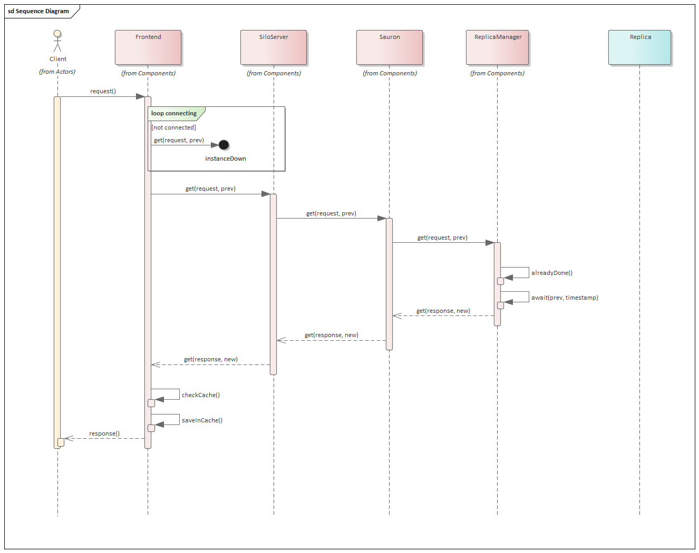
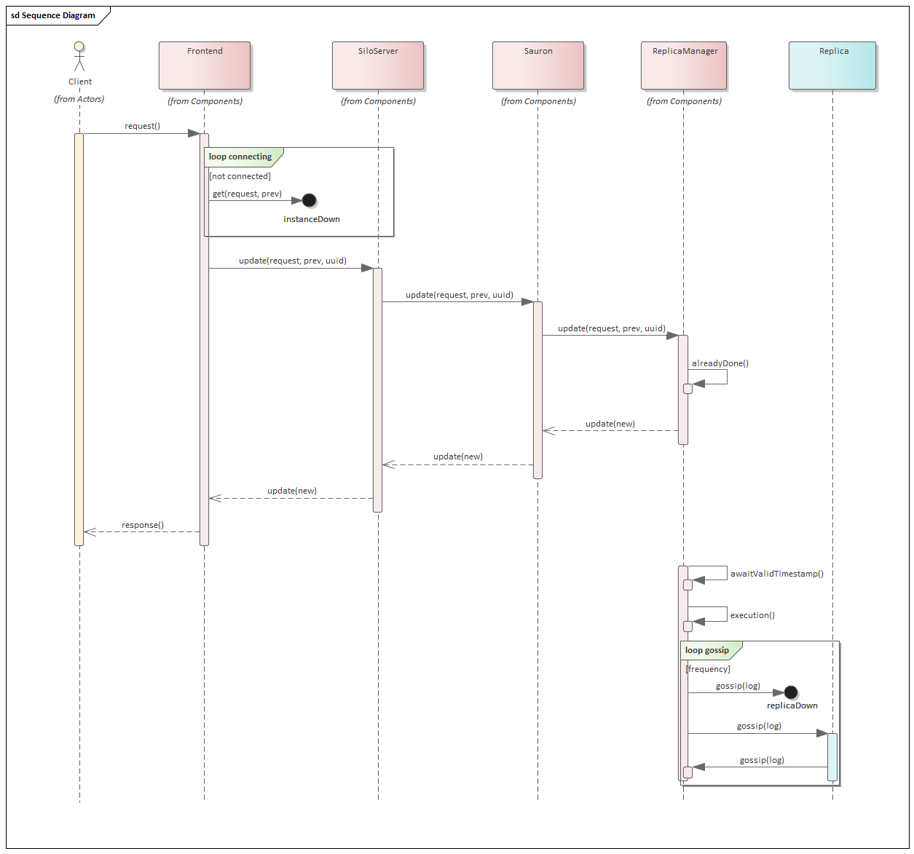

# Sauron Project Report

[](https://dei.tecnico.ulisboa.pt)

Distributed Systems 2019/2020, Second Semester

## Authors

**Group A46**

| Number | Name              | User                             | Email                                      |
| -------|-------------------|----------------------------------| ------------------------------------------ |
| 89455  | Henrique Dias     | <https://github.com/hacdias>     | <mailto:henrique.dias@tecnico.ulisboa.pt>  |
| 89466  | Isabel Soares     | <https://github.com/isabelSoares>| <mailto:isabel.r.soares@tecnico.ulisboa.pt>|
| 89535  | Rodrigo Sousa     | <https://github.com/Sousa99>     | <mailto:rodrigo.b.sousa@tecnico.ulisboa.pt>|

  

## Table of Contents

- [Authors](#authors)
- [First Part Improvements](#first-part-improvements)
- [Fault Model](#fault-model)
- [Solution](#solution)
- [Replication Protocol](#replication-protocol)
    + [Get Operations](#get-operations)
    + [Add Operations](#add-operations)
    + [Gossip Operations](#gossip-operations)
- [Implementation Specifics](#implementation-specifics)
    + [Log Clean Up](#log-clean-up)
    + [Persistent Storage](#persistent-storage)
    + [Client Consistent Reads](#client-consistent-reads)
- [Final Remarks](#final-remarks)

## First Part Improvements

We made some slight improvements relatively to the first delivery, taking into account what the teachers told us.

- **Add tests for invalid camera names** ([commit](https://github.com/tecnico-distsys/A46-Sauron/commit/d0cd7d18ceae2f04ab60c559351ddf7535217451)) - we were not testing whether or not Sauron was throwing an exception when we gave a name with special characters so we added a new test for it. We already tested names with too much characters.
- **Synchronize shared variables** ([commit](https://github.com/tecnico-distsys/A46-Sauron/commit/9bbd41ce74a592654d572a0b59faeb222d213a06)) - we were not correctly synchronizing shared variables because we did not notice that our server could handle asynchronous requests from the clients. The linked commit does not handle all the fixes so we advise you to take a look at our [`ReplicaManager`](../silo-server/src/main/java/pt/tecnico/sauron/silo/domain/ReplicaManager.java) to see how we handle correctness between shared variables.
- **Accept camera with same specifications** ([commit](https://github.com/tecnico-distsys/A46-Sauron/commit/02b35fdd471efb15a3194e2333990e55f34a845f)) - we were considering two camera joins with the same specifications (name and coordinates) as a duplicate camera. In the meanwhile, we were informed that the camera join operation should be considered as a login, thus we should accept cameras with the same specifications. Only if the camera has the same name but different coordinates, it is considered duplicated.

## Fault Model

- We do not tolerate byzantine faults.
- We tolerate transient faults by the server, i.e., if a server crashes silently, the client reconnects with another server instance and when the server comes back it will recover successfully.

We do not tolerate all other faults not mentioned above.

## Solution



> Read Request Diagram



> Update Request Diagram

For our solution, we decided to implement the Gossip protocol (described [bellow](#replication-protocol)) with a Front End, that is the library that clients must use to connect with the server and a server composed by three main classes: `SiloServer`, `Sauron` and a `ReplicaManager`. The Front End contacts with a `SiloServer`, which unpacks the [GRPC](https://grpc.io/) calls into a `Sauron` request which, in turn, makes the data requests to the `ReplicaManager`. Then, every 30 seconds, each `ReplicaManager` contacts with other Replica, sending them gossips 💬.

## Replication Protocol

For our replication protocol between replicas, we decided to use a modified [_gossip_ protocol](https://en.wikipedia.org/wiki/Gossip_protocol). Each replica has its own Replica Manager (RM), which handles all the data operations done in each Replica. Each RM contains:

- _Value_: the value that is stored on each replica, which, in this case, are the cameras and the observations.
- _Value Timestamp_: a timestamp representing the operations done by each replica to achieve the current value on the current replica.
- _Log_: all the update operations the replica has accepted so far. It may contain already processed operations that are yet required to be propagated to other replicas.
- _Replica Timestamp_: represents all the operations the current replica has accepted, i.e., that were placed in the log.
- _Executed Operations_: a list with the unique IDs of the executed operations on the current replica.
- _Timestamp Table_: a list with the the known replica timestamps from other replicas.

Let's define some operations _a priori_:

```
merge(tsA, tsB):
  for each entry i in tsA
    if tsA[i] > tsB[i]
      tsB[i] = tsA[i]
```

### Get Operations

When a client wants to fetch a Camera information or Observations, it sends the `previous` timestamp as well as the request information. Then, the server proceeds as follows:

1. Compares the `previous` timestamp with the `valueTimestamp` to see if we can safely read the value to ensure consistency, i.e., if `previous` <= `valueTimestamp`.
2. If the previous condition is met, the server replies the required information.

Otherwise, wait.

### Add Operations

When a client wants to add a new Camera or Observation, it generates a [UUID](https://en.wikipedia.org/wiki/Universally_unique_identifier) _id_ to uniquely identify the request. Then, it sends the `id`, the `data` (Camera or Observations) and the `previous` timestamp that was stored in the client. When the request `req` arrives in the server, the replica checks decides whether of not to discard the request. A request is discarded if:

- The `id` is present on the executed operations list; or
- The `id` is present on any log record.

If the request is accepted, then we follow the algorithm:

1. Update the replica timestamp by incrementing the ith entry, where `i` is the current instance number starting on 0.
2. Create a unique `timestamp` to represent the operation from now on. This timestamp is created by duplicating `previous` and replacing the ith entry with the previously calculated value.
3. Creates a new log record with the new `timestamp`, the current instance number, the `id` and the data to add.
4. Returns the new timestamp to the client.
5. Checks if the operation can be executed immediately by checking if `previous` <= `valueTimestamp`. If possible, execute `merge(timestamp, valueTimestamp)`.

Otherwise, wait.

### Gossip Operations

The gossip operations are required to ensure all replicas end up receiving all the information, eventually. By default, we send these messages every 30 seconds, which can be customized. On a gossip request, a replica _i_ sends to the replica _j_:

- The instance number _i_;
- The `sourceTimestamp`, which is the replica timestamp of replica _i_;
- The logs records we estimate the replica _j_ does not have. [See bellow.](#client-consistent-reads)
  
When the replica _j_ receives the gossip message from the replica _i_, it then proceeds as follows:

1. Updates the entry _i_ in the timestamp table with the `replicaTimestamp`;
2. For each log record `r`:
    - Checks if `r.id` is on the executed operations list. If so, discards.
    - Checks if `r.timestamp` > `replicaTimestamp`. If not, discards.
    - Adds the record to its own record log.
3. Updates `replicaTimestamp`, by executing `merge(sourceTimestamp, replicaTimestamp)`.
4. Goes through the log and executes all stable operations.
5. Finally, cleans up the log. [See bellow.](#log-clean-up)

## Implementation Specifics

### Log Clean Up

We decided to implement a log purge, freeing some space, by comparing every timestamp on the table of timestamps with each record's timestamp. Being `c` the number of the instance where the record was initially created, if the every timestamp's _c_ entry >= record's timestamp _c_ entry, then it means the record can be safely removed from the log since all replicas already received that information.

### Persistent Storage

Since we cleanup the entry logs, we needed a way to persist the data. To do so, we are using Java's native [Serialization library](https://docs.oracle.com/javase/10/docs/api/java/io/Serializable.html). Each replica has its own data file, allowing for transient faults or even complete shutdowns or restarts a replica. 

### Client Consistent Reads

To avoid a client stumbling in a situation where they talk different replicas and getting the inconsistent results, we decided to implement a request-response cache. The cache stores the last _n_ requests and if we receive a request from a replica whose timestamp is older than what the client has previously seen, we return the cached value instead.

## Final Remarks

Despite COVID-19, we were able to successfully complete our project in due time, which allowed us to enjoy this emmersive experience into the decentralized systems... with gossips.
